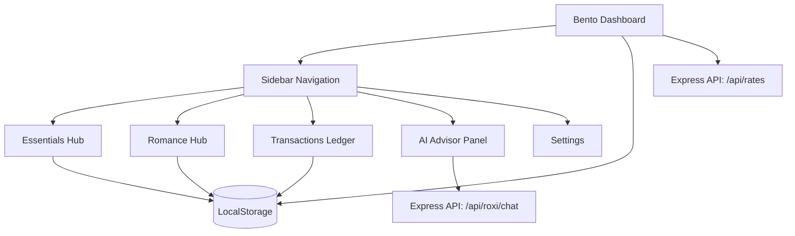

# 💸 TAKA — Bento Personal Finance Tracker

A minimal, high-contrast Obsidian Bento-style Personal Finance & Student Budget Platform tailored for Bangladeshi students and young professionals.

---

## 🌟 Key Features

### 1. 📊 Minimal Bento Dashboard
- **Net Liquid Balance:** Real-time balance calculations with instant inflow/outflow breakdown.
- **Monthly Budget Velocity Gauge:** Visual progress meter tracking budget consumption and calculating safe daily spend limits.
- **Top Spending Areas:** Visual percentage matrix of your primary expense categories.
- **Live Foreign Exchange Ticker:** Live BDT exchange rates for USD, EUR, GBP, and SAR with an instant bidirectional currency converter.
- **Recent Transactions Ledger:** Quick snapshot of recent financial entries.

### 2. 🚬 Essentials & Mixed Combos Hub
- **Realistic Market Pricing:** Marlboro Advance (৳23), Camel (৳16), Benson & Hedges (৳23), Dunhill Switch (৳25), Gold Leaf (৳18), Lucky Strike (৳12), Star Filter (৳10), and Navy (৳8).
- **Multi-Brand Mixed Combos:**
  - **1 Advance + 2 Camel Classic (`৳55`)**
  - **1 Advance + 2 Camel + Hot Milk Tea (`৳70`)**
  - **1 Benson + 2 Gold Leaf (`৳74`)**
  - **2 Advance + 1 Dunhill + Raw Tea (`৳79`)**
- **Custom Multi-Brand Mixer:** Build any mixed combination with individual stick counters and 1-tap logging.
- **Daily Budget Matcher:** Enter your daily budget to see all affordable stick counts and beverage pairings.

### 3. 💕 Romance & Social Outings Hub
- **Relatable BD Student Date Presets:**
  - *TSC Ice Cream & Philosophical Convos (`৳180`)*
  - *Dhanmondi Lake Fuska & Jhalmuri Date (`৳160`)*
  - *Aesthetic Cafe Date (`৳850`)*
  - *Rainy Day Hood-Down Rickshaw Ride (`৳280`)*
  - *Apology Peace Treaty: Boba + Brownie (`৳420`)*
  - *Midnight Pizza (`৳680`)*
  - *Surprise Beli Phul & Chocolates (`৳250`)*
- **Emergency Date Packages:**
  - *The "I Messed Up / Peace Treaty" Deluxe (`৳1,480`)*
  - *Rainy Day Dhanmondi Hood-Down Romance (`৳580`)*
- **Month Love Spend & Simp Score (100%)** tracking.

### 4. 📋 Full Transactions Ledger & Export
- Search and filter by category or transaction type (Income/Expense).
- Export complete transaction records to CSV spreadsheets.

### 5. 🤖 AI Financial Advisor
- Integrated with Google Gemini for burn rate checks, monthly saving strategies, and custom financial advice.

---

## 🏛️ System Architecture



---

## 🛠️ Tech Stack

- **Frontend:** React 19, TypeScript, Tailwind CSS, Lucide Icons
- **Backend:** Node.js, Express.js
- **Build Engine:** Vite, ESBuild, TSX
- **AI Model:** Google Gemini API
- **Data Storage:** Client-side `localStorage` with JSON/CSV export support

---

## 🚀 Getting Started

### 1. Prerequisites
Ensure you have **Node.js** (v18 or higher) and **npm** installed.

### 2. Installation

```bash
# Clone the repository
git clone https://github.com/pbs002-s/khoroch-os.git
cd khoroch-os

# Install dependencies
npm install
```

### 3. Environment Configuration (Optional)
Create a `.env` file in the root directory:

```env
PORT=3000
GEMINI_API_KEY=your_gemini_api_key_here
```

### 4. Run Development Server

```bash
npm run dev
```

Open your browser and navigate to `http://localhost:3000`.

---

## 📁 Project Structure

```text
financ-tracker/
├── src/
│   ├── components/
│   │   ├── AnimatedNumber.tsx           # Numerical rolling counter
│   │   ├── BentoDashboard.tsx           # Minimal Bento Dashboard
│   │   ├── CigaretteSmartSuggestion.tsx # Mixed combos & budget matcher
│   │   ├── RomanceTab.tsx               # Partner presets & date packages
│   │   ├── Sidebar.tsx                  # Collapsible sidebar navigation
│   │   ├── Navbar.tsx                   # Top header bar
│   │   ├── TransactionsTab.tsx          # Ledger & CSV export
│   │   ├── AIPanel.tsx                  # Gemini AI Advisor chat
│   │   ├── SettingsTab.tsx              # Allowance limit & backups
│   │   ├── AddExpenseModal.tsx          # Expense entry modal
│   │   ├── AddIncomeModal.tsx           # Income entry modal
│   │   ├── BottomNav.tsx                # Mobile navigation
│   │   └── Toast.tsx                    # Notification toasts
│   ├── constants/
│   │   ├── categories.ts                # Categories & presets
│   │   └── icons.tsx                    # Dynamic Lucide icons
│   ├── types.ts                         # Domain type definitions
│   ├── App.tsx                          # App container & router
│   ├── index.css                        # Obsidian theme styles
│   └── main.tsx                         # React entry point
├── server.ts                            # Express API proxy
├── package.json                         # Dependencies & scripts
└── README.md                            # Documentation
```

---

## 📄 License

This project is open-source and available under the [MIT License](LICENSE).
