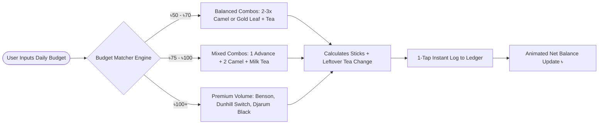

<div align="center">

  <!-- Animated Header Banner -->
  <a href="https://github.com/pbs002-s/financ-tracker">
    
  </a>

  <p align="center">
    <strong>A high-contrast, obsidian dark-themed Personal Finance & Bento Intelligence Platform tailored for Bangladeshi students and young professionals.</strong>
  </p>

  <p align="center">
    <a href="#-core-highlights"></a>
    <a href="#-tech-stack"></a>
    <a href="#-tech-stack"></a>
    <a href="#-tech-stack"></a>
    <a href="#-tech-stack"></a>
    <a href="#-tech-stack"></a>
  </p>

  <p align="center">
    <a href="#-features-overview">Features</a> •
    <a href="#-architecture--flow-graphs">System Flowcharts</a> •
    <a href="#-essentials--mixed-combo-engine">Essentials Engine</a> •
    <a href="#-romance--social-tracker">Romance Hub</a> •
    <a href="#-getting-started">Getting Started</a> •
    <a href="#-project-structure">Project Structure</a>
  </p>

</div>

---

## 💎 Features Overview

```
┌────────────────────────────────────────────────────────────────────────────────────────┐
│                                 TAKA BENTO DASHBOARD                                   │
├────────────────────────────────────────┬───────────────────────────────────────────────┤
│ 💳 NET LIQUID BALANCE HERO             │ 📊 MONTHLY BUDGET VELOCITY GAUGE              │
│ • Live Animated Rolling Counter (৳)    │ • 14% Used of ৳20,000 allowance               │
│ • +৳21,000 Inflow  |  -৳2,746 Outflow  │ • Safe Daily Spend: ৳1,438 / day              │
│ • 87% Net Savings Rate                 │ • Visual color-changing progress meter        │
├────────────────────────────────────────┴───────────────────────────────────────────────┤
│ 🚬 ESSENTIALS & COMBO INTELLIGENCE HUB                                                 │
│ • Mixed Combos: 1 Advance + 2 Camel (৳55), 1 Benson + 2 Gold Leaf (৳74)               │
│ • Daily Budget Matcher: Input ৳80/day → Real-time brand allocations + tea pairings    │
│ • Interactive Multi-Brand Mixer with 1-tap ledger logging                             │
├────────────────────────────────────────┬───────────────────────────────────────────────┤
│ 💕 ROMANCE & SOCIAL OUTINGS HUB        │ 💱 LIVE FOREX RATES & BDT CONVERTER           │
│ • Funny & Relatable BD Date Presets    │ • Real-time USD, EUR, GBP, SAR ticker         │
│ • Emergency Peace Treaty (৳1,480)      │ • Instant bidirectional BDT conversion        │
│ • Simp Score: 100% 💕                  │ • Cached resilient API backend proxy          │
└────────────────────────────────────────┴───────────────────────────────────────────────┘
```

---

## 📊 Architecture & Flow Graphs

### 1. System Architecture

```mermaid
graph TD
    subgraph Client ["🖥️ Client (React 19 + Vite + Tailwind 4)"]
        A[Bento Dashboard] --> B[Sidebar Navigation Hub]
        B --> C[Essentials & Combo Mixer]
        B --> D[Romance & Social Tracker]
        B --> E[Transactions Ledger]
        B --> F[AI Advisor Panel]
        B --> G[Settings & Budget Limit]
        A --> H[Animated Rolling Numbers]
    end

    subgraph Storage ["💾 Local Persistence"]
        I[(LocalStorage: txns)]
        J[(LocalStorage: budget_limit)]
    end

    subgraph Backend ["⚡ Node.js Express Server"]
        K[server.ts API Gateway]
        K --> L[/api/rates FX Feed]
        K --> M[/api/roxi/chat Gemini AI API]
    end

    C --> I
    D --> I
    A --> I
    A --> J
    G --> J
    A -.-> L
    F -.-> M
```

---

### 2. Daily Budget → Cigarette & Daily Essentials Allocator Flow



---

## 🚬 Essentials & Mixed Combo Engine

Customized for accurate Bangladeshi market pricing and student lifestyle habits:

| Brand Name | Price / Stick | Market Tier | Signature Tagline |
|:---|:---:|:---:|:---|
| **Marlboro Advance** | **৳23** | Premium | Modern youth favourite blend |
| **Camel (Yellow / Blue)** | **৳16** | Standard | Smooth rich Turkish-American tobacco |
| **Benson & Hedges** | **৳23** | Premium | Classic campus aristocrat choice |
| **Dunhill Switch** | **৳25** | Premium | Cool capsule click luxury |
| **Gold Leaf** | **৳18** | Standard | National student staple standard |
| **Lucky Strike** | **৳12** | Budget | Pocket-friendly toasted campus staple |
| **Manchester Special** | **৳15** | Standard | Sleek aromatic campus alternative |
| **Djarum Black / Ice** | **৳25** | Premium | Clove spicy kick for exam night |
| **Star Filter** | **৳10** | Budget | Maximum stick volume on a tight budget |
| **Navy / Sheikh** | **৳8** | Survival | Hardcore survival budget tier |

### ⚡ Popular 1-Tap Mixed Combos
- 🐪⚡ **1 Advance + 2 Camel Classic (`৳55`)** — *The ultimate balanced student dual-blend*
- ☕ **1 Advance + 2 Camel + Milk Tea (`৳70`)** — *Afternoon campus hangout package*
- 👑 **1 Benson + 2 Gold Leaf (`৳74`)** — *Morning luxury smoke + afternoon grind*
- ⚡ **2 Advance + 1 Dunhill + Raw Tea (`৳79`)** — *Exam all-nighter focus session*

---

## 💕 Romance & Social Outings Hub

A hilarious, charming, and deeply relatable student relationship budget tracker:

- 🍦 **TSC Ice Cream & Philosophical Convos (`৳180`)** — *"Sharing 1 Cornetto & pretending to understand life"*
- 🍜 **Dhanmondi Lake Fuska & Jhalmuri Date (`৳160`)** — *"Extra tok, extra love, zero digestive regrets"*
- ☕ **Aesthetic Cafe Date (`৳850`)** — *"Taking 45 photos while the iced latte gets warm"*
- 🛺 **Rainy Day Hood-Down Rickshaw Ride (`৳280`)** — *"Bollywood slow-mo song scene in Dhaka traffic"*
- 🧋 **Apology Peace Treaty: Boba + Brownie (`৳420`)** — *"Because she said 'It's fine' with THAT specific tone"*
- 🍕 **Midnight Pizza (`৳680`)** — *"'I'll only take 1 bite' -> finishes half the pizza"*
- 🌸 **Surprise Beli Phul & Chocolates (`৳250`)** — *"+100 Aura relationship booster"*
- 🚨 **The "I Messed Up / Peace Treaty" Deluxe Date (`৳1,480`)** — *Boba + Dinner + Flowers = 100% Guaranteed Peace*

---

## 🛠️ Tech Stack

```text
Frontend Framework:     React 19 + TypeScript (strict mode)
Styling & Tokens:       Tailwind CSS v4 + Vanilla CSS Custom Properties
Build Engine:           Vite 6 + ESBuild + TSX
Animations:             Custom RequestAnimationFrame Counters, Keyframe Orbs & Matrix Mesh
Backend Server:         Node.js + Express 4.21 API Gateway
AI Integration:         Google Gemini Generative AI Model
Icons & Typography:     Lucide React, Plus Jakarta Sans, Inter, JetBrains Mono
Persistence:            Client-side localStorage with JSON Backup & CSV Export
```

---

## 🏁 Getting Started

### 1. Prerequisites
- **Node.js** (v18.0.0 or higher recommended)
- **npm** (v9.0.0 or higher)

### 2. Clone & Install

```bash
# Clone the repository
git clone https://github.com/pbs002-s/financ-tracker.git
cd financ-tracker

# Install all dependencies
npm install
```

### 3. Environment Setup (Optional for AI Advisor)
Create a `.env` file in the project root:

```env
PORT=3000
GEMINI_API_KEY=your_gemini_api_key_here
```

### 4. Run Development Server

```bash
npm run dev
```
Open **[http://localhost:3000](http://localhost:3000)** in your browser.

---

## 📁 Project Structure

```text
financ-tracker/
├── src/
│   ├── components/
│   │   ├── AnimatedNumber.tsx           # Rolling numerical ticker with smooth easing
│   │   ├── BentoDashboard.tsx           # Minimal core Bento Dashboard
│   │   ├── CigaretteSmartSuggestion.tsx # Multi-brand mixed combos & budget matcher
│   │   ├── RomanceTab.tsx               # Funny & romantic partner date tracker
│   │   ├── Sidebar.tsx                  # Collapsible desktop & mobile sidebar
│   │   ├── Navbar.tsx                   # Top header with live FX ticker & quick actions
│   │   ├── TransactionsTab.tsx          # Complete ledger with search, filters & CSV
│   │   ├── AIPanel.tsx                  # Gemini AI financial co-pilot
│   │   ├── SettingsTab.tsx              # Monthly allowance limit & data export
│   │   ├── AddExpenseModal.tsx          # High-contrast expense entry modal
│   │   ├── AddIncomeModal.tsx           # High-contrast income entry modal
│   │   ├── BottomNav.tsx                # Mobile bottom navigation bar
│   │   └── Toast.tsx                    # Animated notification toasts
│   ├── constants/
│   │   ├── categories.ts                # Default categories & funny presets
│   │   └── icons.tsx                    # Dynamic Lucide icon mappings
│   ├── types.ts                         # Complete TypeScript domain interfaces
│   ├── App.tsx                          # Root application layout & state router
│   ├── index.css                        # Obsidian tokens, matrix grid & ambient mesh
│   └── main.tsx                         # Client application entry point
├── server.ts                            # Express backend with /api/rates & /api/roxi/chat
├── package.json                         # Dependencies & npm scripts
└── README.md                            # Documentation
```

---

<div align="center">
  <p>Built with ❤️ for students managing daily budgets, romance, and essentials in Bangladesh.</p>
  <p>© 2026 TAKA Finance Tracker. Open source under the <a href="LICENSE">MIT License</a>.</p>
</div>
